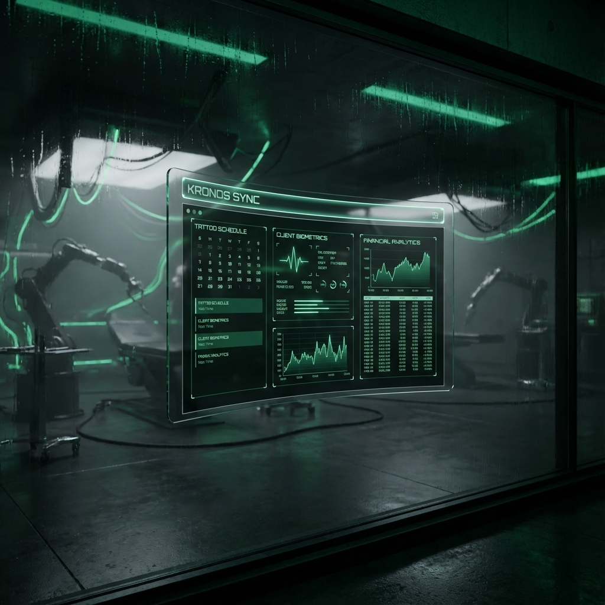
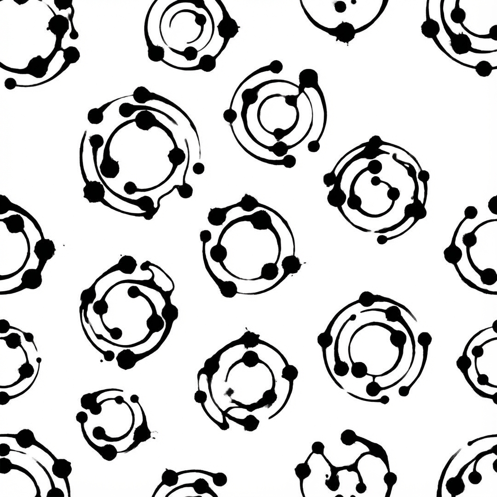
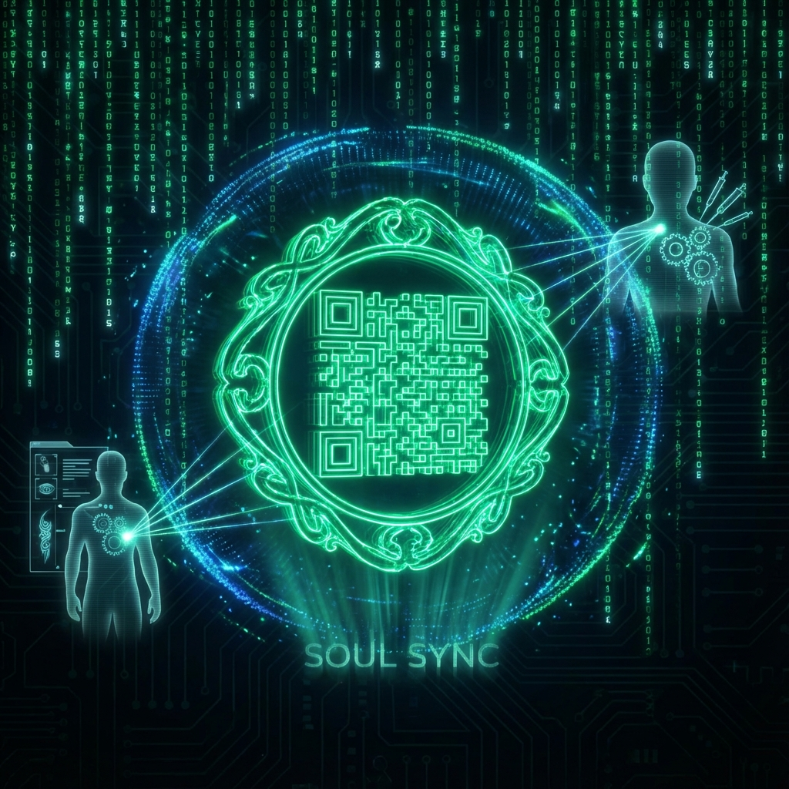
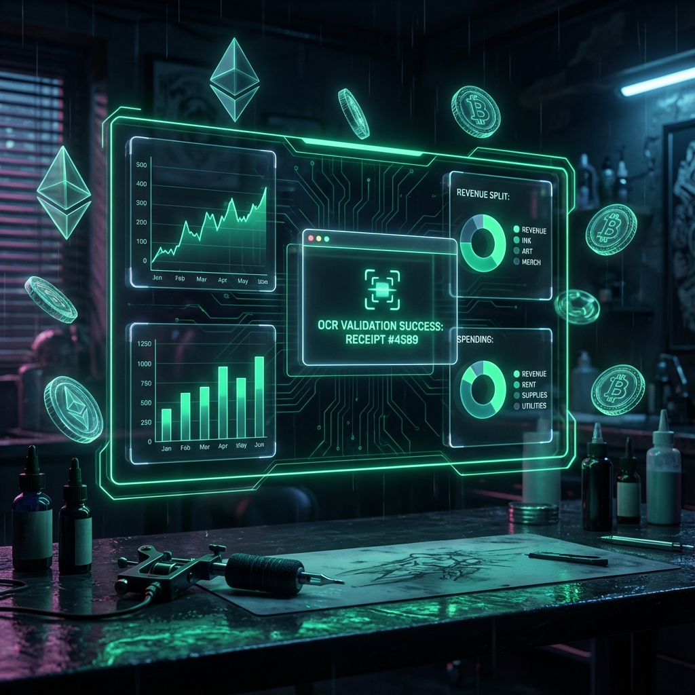
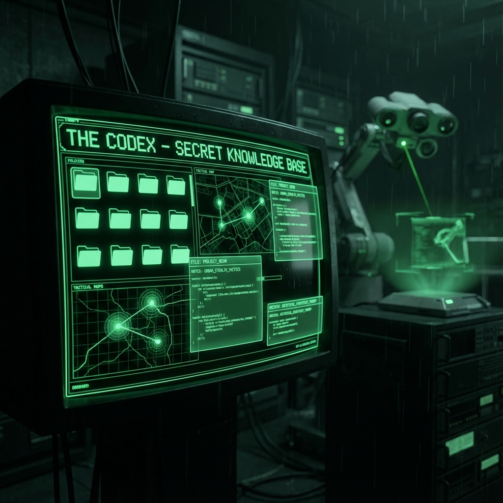

  
   
  
   
   
  

      
      
      
      
  

  

    <strong>OPERATING SYSTEM FOR THE ARTISTIC ELITE</strong>
  

   
  

 

> *"Where technology meets the soul of the ink. A seamless fusion between surgical management and pure artistic expression."*

---

## 🔒 RESTRICTED ACCESS // PROPRIETARY SOFTWARE
**Copyright © 2025 Kronos Tech Division.**
This source code is available exclusively for **auditing, internal development, and portfolio demonstration**. Reproduction, distribution, or commercial use without express authorization from **Symbeon Labs** is strictly prohibited.

---

## 💎 THE VISION
**KRONØS SYNC** is not just a scheduler; it is a complete operating system for studios that treat tattoo as high-level art and business. It eliminates administrative friction, allowing artists to focus solely on creating, while the system orchestrates logistics, finance, and customer experience with surgical precision.

---

## [ 01 ] THE IDENTITY // ANAMNESIS
**Digital Safety & Biometric Flow**

KRONØS captures the essence of clinical safety with elegance. Biometric signatures and intelligent screening transform bureaucracy into an identity snapshot.
- **Biometric Canvas:** Fluid digital signature capturing pressure and stroke.
- **Clinical Intelligence:** Automated alerts for medical conditions.
- **Data Sovereignty:** Full LGPD/GDPR compliance with siloed workspaces.

---

## [ 02 ] THE LINK // KIOSK
**Gamification & Lead Conversion**

The reception is the first contact with the sacred. **THE LINK** gamifies the companion's journey, converting curiosity into clients via **Soul Sync**.

*The "INK PASS" is not a discount; it is an invitation to synchronization.*

---

## [ 03 ] THE VAULT // FINANCE
**Auto-Settle & AI Vision**

Absolute financial transparency. **THE VAULT** uses Computer Vision to validate settlements and reward professionalism with digital glyphs.

- **AI Vision Agent:** Instant OCR validation of payment proofs.
- **Revenue Split:** Automated calculation (100% Artist -> Studio Commission).
- **Sync Glyphs:** Prestige tokens generated by synchronization algorithms.

---

## [ 04 ] THE CODEX // KNOWLEDGE
**Role-Based Documentation System**

The **CODEX** is the tactical knowledge library of KRONØS. It is not just documentation; it is a living training and governance system.

- **Role-Based Access:** Automatic curation by hierarchy (Artist / Admin / Dev).
- **Premium UI:** Tactical terminal interface with dynamic Markdown rendering.
- **Agent-Ready:** Semantic metadata for AI interoperability (DocSync).

### 📚 Available Documentation
| Category | Access | Description |
| :--- | :---: | :--- |
| **📘 Training** | ARTIST | [Artist Guide](kronos/docs/training/artist-guide.md), [Growth Strategies](kronos/docs/training/growth-strategies.md) |
| **🛡️ Governance** | ADMIN | [Admin Guide](kronos/docs/training/admin-guide.md), [Data Sovereignty](kronos/docs/governance/data-sovereignty.md) |
| **💰 Finance** | ADMIN | [Marketplace Commissions](kronos/docs/governance/marketplace-commissions.md) |
| **🏗️ Engineering** | DEV | [Architecture Map](kronos/ARCHITECTURE.json), [Roadmap (EAP)](kronos/EAP.md) |

---

## 🛠️ THE STACK // ENGINEERING

Built under the silence of the night, utilizing the deepest layers of performance:

### Core Architecture
- **Engine:** Next.js 16 (Turbopack)
- **Interface:** React 19 + Tailwind CSS v4 (Cyber Y2K Theme)
- **Persistence:** Prisma ORM v5.22.0 + PostgreSQL (Neon)
- **Intelligence:** OpenAI GPT-4 (KAI) + Google Calendar Sync

---

  

    <strong>KRONØS TECH DIVISION</strong> 
    Developed by SH1W4 // Architecture by Antigravity 
    Powered by Symbeon Labs
  

  

