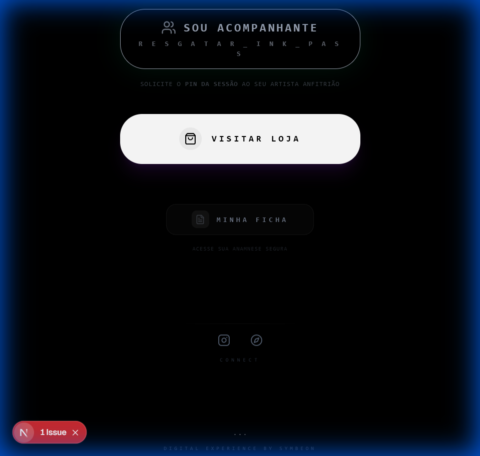
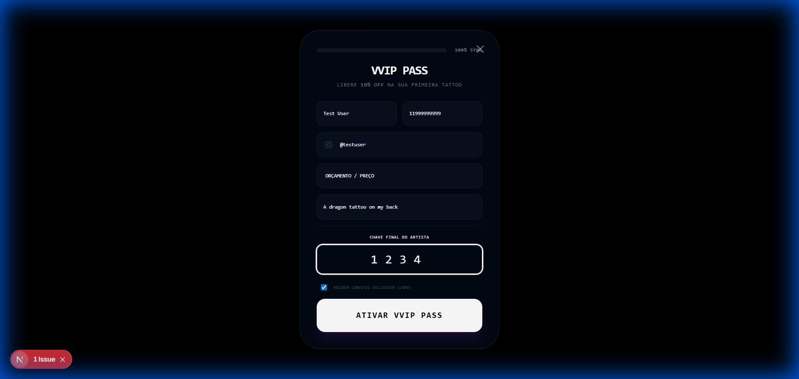
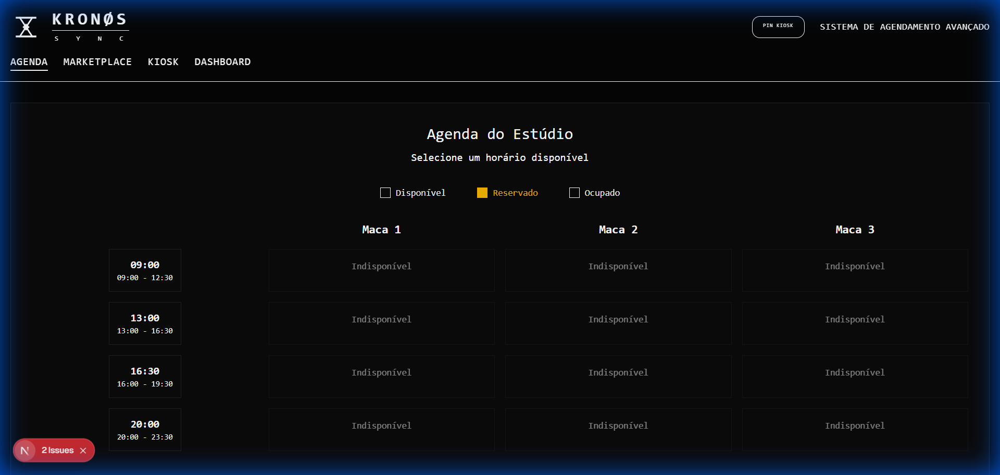
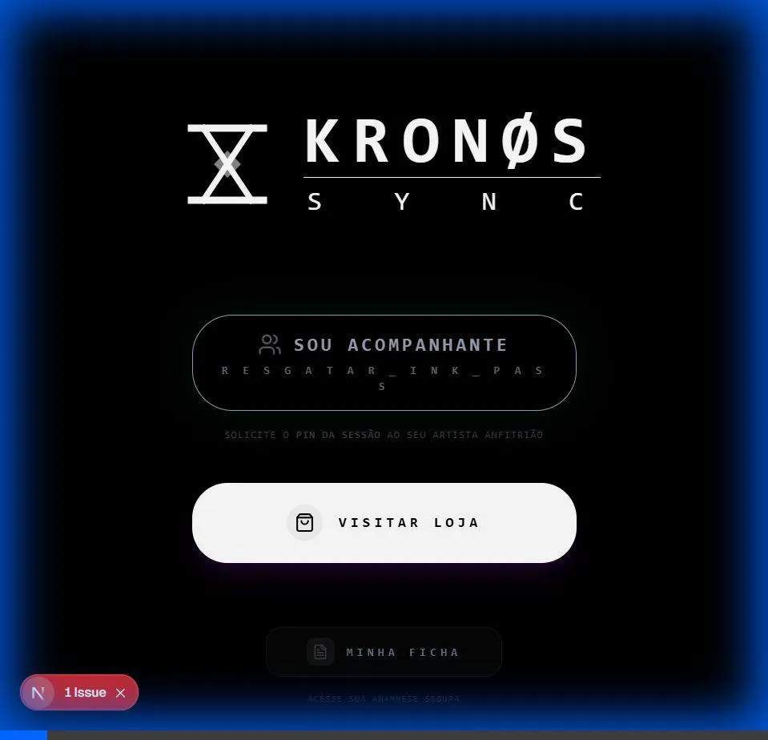

  
   
   
  <h1 align="center">K R O N O S _ S Y N C</h1>
  

    <strong>OPERATING SYSTEM FOR THE ARTISTIC ELITE</strong>
  

   
  

 

> *"Where technology meets the soul of the ink. A seamless fusion between surgical management and pure artistic expression."*

---

## 🔒 ACESSO RESTRITO & LICENCIAMENTO
**Este software é proprietário e protegido por direitos autorais.**
O código-fonte disponível neste repositório é destinado exclusivamente para fins de **auditoria, desenvolvimento interno e demonstração de portfólio**. A reprodução, distribuição ou uso comercial sem autorização expressa do **Kronos Tattoo Studio** é estritamente proibida.

---

## 💎 VISÃO DO PRODUTO
O **KRONOS SYNC** não é apenas um agendador; é um sistema operacional completo para estúdios que tratam tatuagem como arte e negócio de alto nível. Ele elimina a fricção administrativa, permitindo que artistas foquem unicamente em criar, enquanto o sistema orquestra a logística, financeiro e experiência do cliente com precisão cirúrgica.

---

## [ 01 ] THE IDENTITY
**Digital Anamnese & Legal Safety**

O KRONOS SYNC captura a essência da segurança clínica com elegância. Assinaturas biométricas e triagem inteligente transformam burocracia em um snapshot de identidade.
- **Biometric Flow:** Assinatura digital fluida.
- **Clinical Insight:** Alertas automáticos de condições médicas (KRONØS Standard).

---

## [ 02 ] THE LINK
**Kiosk, Conversion & Lead Magnet**

A recepção é o primeiro contato com o sagrado. O **THE LINK** gamifica a jornada do acompanhante, convertendo curiosos em clientes via **Soul Sync**.

*O "INK PASS" não é um desconto; é um convite para a sincronização.*

---

## [ 03 ] THE VAULT
**Settle, AI Vision & Tokenization**

Transparência financeira absoluta. O **THE VAULT** utiliza Visão Computacional para validar liquidações e premiar o profissionalismo com glifos digitais.

- **AI Vision Agent:** Validação OCR instantânea de comprovantes.
- **Sync Glyphs:** Tokens de prestígio gerados por algoritmos de sincronia.

---

## [ EVOLUTION ] THE FLOW

| JOURNEY | SETTLEMENT |
| :---: | :---: |
|  |  |

---

## 🛠️ ENGENHARIA (THE STACK)

Construído sob o silêncio da noite, utilizando as camadas mais profundas de performance:
- **Engine:** Next.js 16 (Turbopack) // React 19 // Tailwind CSS v4
- **Persistence:** Prisma ORM v5.22.0 // PostgreSQL (Neon/Vercel)
- **Intelligence:** Google Calendar API Sync // AI Vision (OCR)
- **Connectivity:** PWA (Progressive Web App) para Experiência Mobile Nativa

---

  

    <strong>KRONOS TECH DIVISION</strong> 
    Developed by SH1W4 // Architecture by Antigravity
  

  

