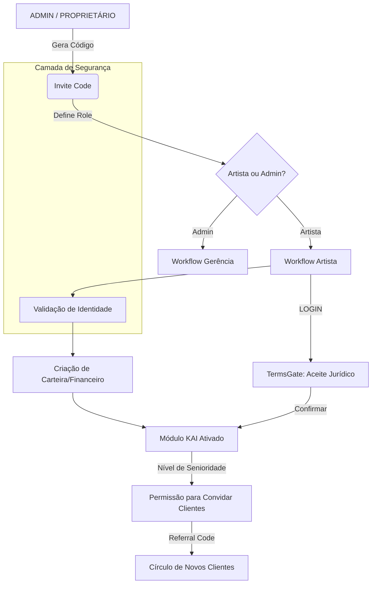
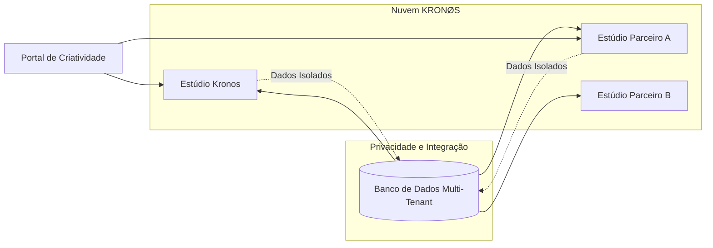

# 🌐 KRONØS SYNC: Estratégia de Expansão e Multi-Workspace

Este documento detalha a visão técnica e comercial para a transição do sistema de um estúdio único para uma plataforma global de gestão de arte e bem-estar (SaaS).

---

## 1. 🧬 Lógica de Convites (Invitation Tree)

O sistema de convites não é apenas para registro; é a camada de segurança que garante que apenas perfis qualificados entrem no ecossistema.

---

## 2. 🏛️ Infraestrutura Multi-Workspace (Tenant Isolation)

Para suportar outros estúdios (ex: "Galeria X", "Studio Y") além do **Kronos**, a arquitetura evolui para:

### Modelo de Dados
- **Global User**: O usuário mantem sua identidade única (Ex: João, o cliente).
- **Workspace Model**: Cada estúdio é um `Workspace`.
- **Relationship**: Usuários pertencem a Workspaces com permissões específicas.

### Liberdade Criativa
- **Theming Engine**: Cada estúdio define sua paleta (Cyberpunk, Minimalista, Brutalista).
- **Custom Vouchers**: O gerador de Gift Cards que criamos hoje será adaptado para usar o branding do `Workspace` atual.

---

## 3. 💰 Plano Estratégico de Monetização

A monetização ocorre em camadas, permitindo que você valide o valor antes de cobrar caro.

| Fase                     | Modelo                      | Foco                                                                                                |
| :----------------------- | :-------------------------- | :-------------------------------------------------------------------------------------------------- |
| **1. Validação (Atual)** | Uso Próprio                 | Estabilizar o Agente KAI e a lógica de comissões no Kronos.                                         |
| **2. Beta Fechado**      | Revenue Share (%)           | Convidar 2-3 estúdios parceiros. Cobrar uma taxa pequena sobre cada agendamento feito pelo sistema. |
| **3. SaaS Pro**          | Assinatura Mensal           | Valor fixo mensal para estúdios (Tier 1: Até 5 artistas, Tier 2: Ilimitado).                        |
| **4. Marketplace**       | Comissionamento de Produtos | Venda de artes, aftercare e produtos físicos via portal do estúdio.                                 |

---

## 4. 🛡️ Segurança e Propriedade de Dados

- **Dados Sensíveis**: Informações de saúde (Anamnese) são criptografadas e visíveis apenas ao estúdio que realizou o atendimento.
- **Shadow Clients**: Clientes convidados por um estúdio não são visíveis para outros estúdios, a menos que o próprio cliente opte por unificar seu perfil.

---

### Próximos Passos Técnicos & Status
- [x] Criar a tabela `Workspace` no Prisma (Concluído).
- [x] Adicionar `workspaceId` em `Booking`, `Artist` e `Order` (Silo de Dados implementado).
- [x] Implementar seletor de estúdio no Dashboard Admin (Exclusivo para Gestão).
- [x] **Linkage Lock:** Implementado o vínculo permanente artista-workspace via chave de acesso (Proteção de Silo).
- [x] **Governance Layer:** Implementado o `TermsGate` mandatório (Artist Agreement v1.0).
- [x] **Supreme Performance:** Otimização de renderização e estabilidade Next.js 15.

---
*Documento atualizado em 21/12/2025: A infraestrutura base para SaaS Multi-Tenant está operacional e blindada.*
