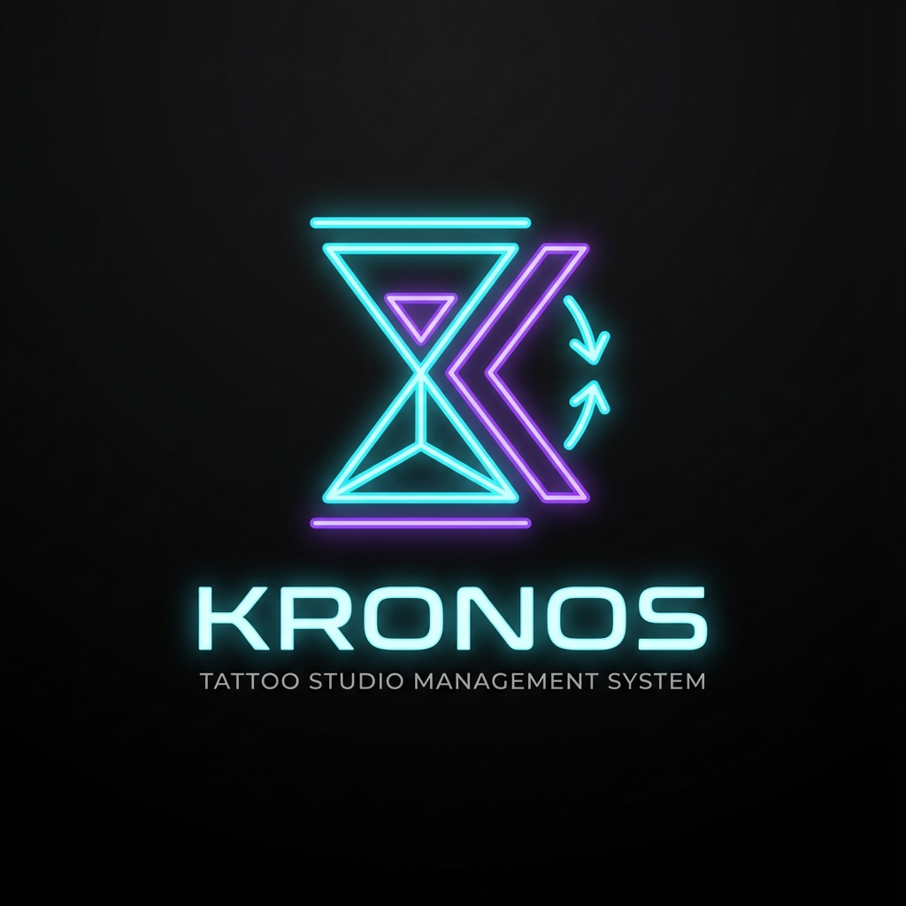
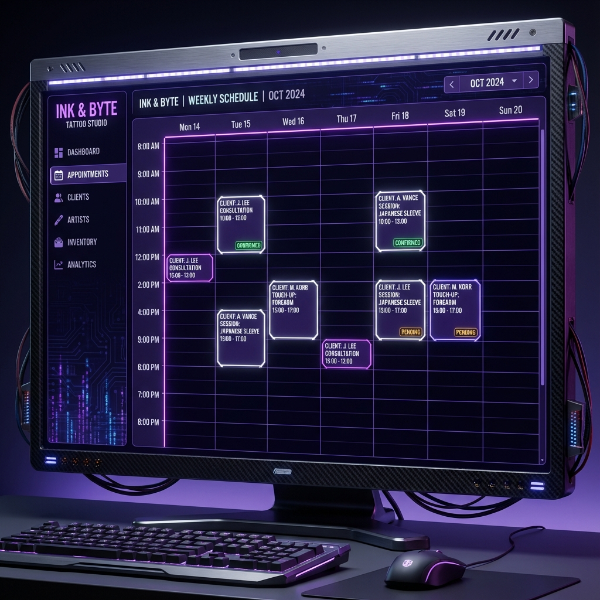
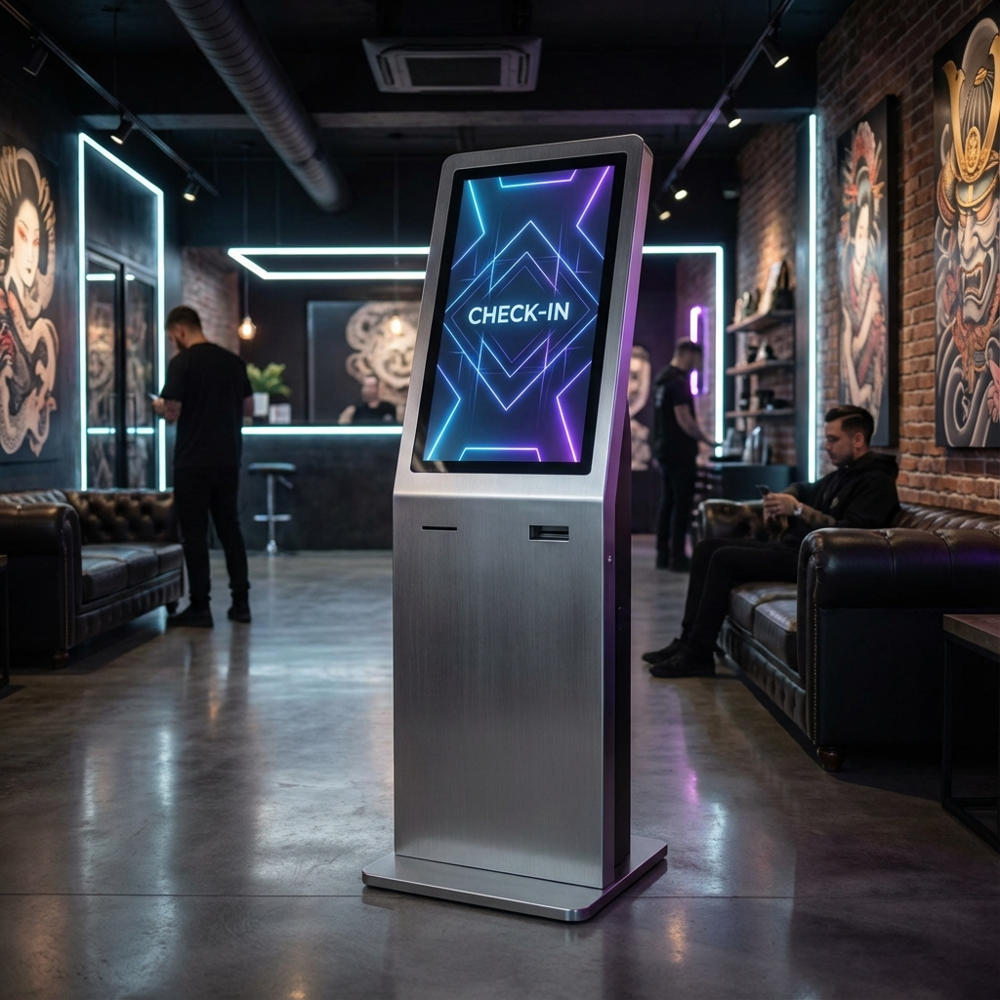
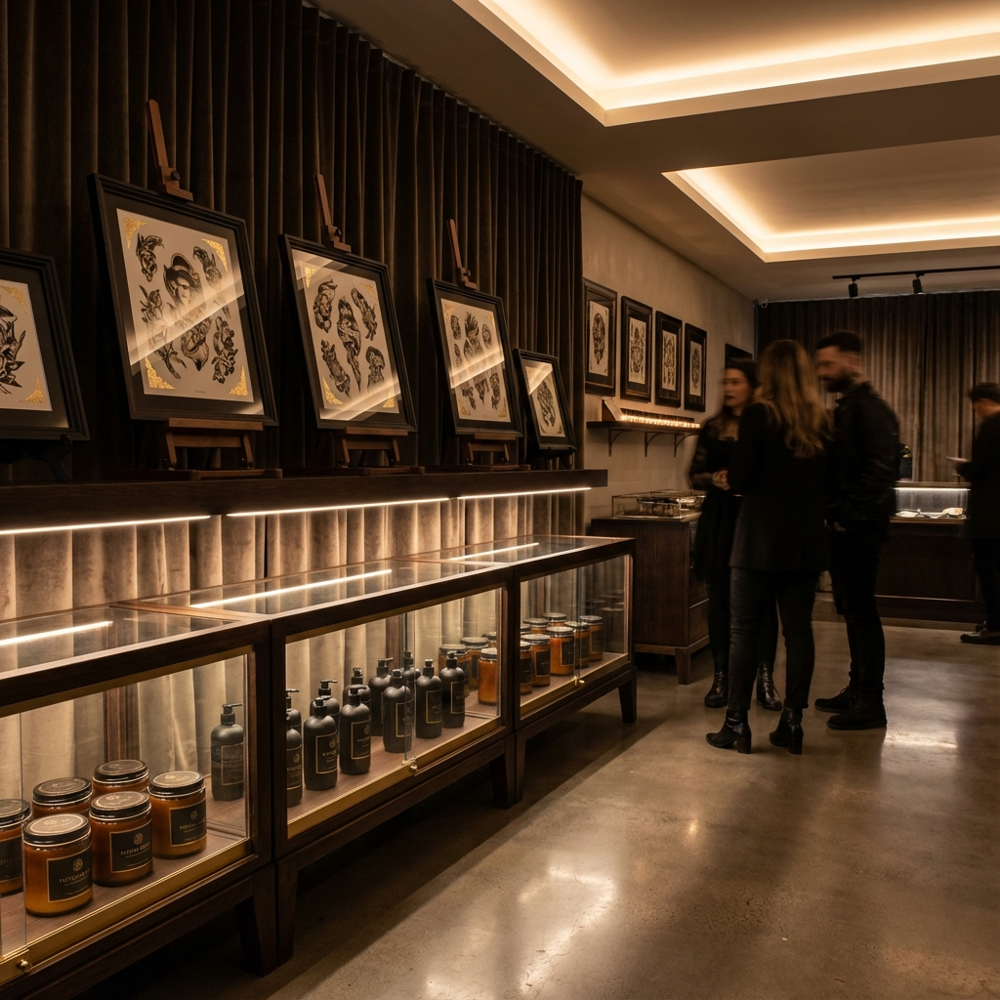

# KAIRØS OS

<div align="center">



> **Enterprise-Grade Tattoo Studio Management Platform**  
> Built with Next.js 15, Prisma, NextAuth, and cutting-edge UX design.

</div>

---

## 🎯 Vision

KAIRØS OS is a **professional-first SaaS platform** designed exclusively for tattoo studios, artists, and administrators. Unlike traditional booking systems, we've architected a **sovereign ecosystem** where:

- **Professionals** (Artists & Admins) have full access to the management dashboard
- **Clients** interact through frictionless, guest-first experiences (Kiosk, Marketplace, Forms)
- **Data sovereignty** ensures each studio owns its client base without polluting the global user registry

---

## 🏗️ Architecture Philosophy

### **The Professional Gate**

KAIRØS implements a **strict invite-only authentication system** for professional access:

```
┌─────────────────────────────────────────────────────────────┐
│                    AUTHENTICATION FLOW                       │
├─────────────────────────────────────────────────────────────┤
│                                                              │
│  👤 New User Attempts Login                                 │
│         │                                                    │
│         ├─► Has Invite Code? ──► YES ──► Create as ARTIST   │
│         │                                                    │
│         └─► No Invite Code? ──► REJECT ──► Error Message    │
│                                                              │
│  🎨 Existing Artist/Admin ──► Direct Access ──► Dashboard   │
│                                                              │
└─────────────────────────────────────────────────────────────┘
```

**Key Benefits:**
- ✅ Zero spam or unauthorized access
- ✅ Clean, focused user base (only team members)
- ✅ Traceable onboarding (who invited whom)
- ✅ Automatic role assignment based on invite type

### **Client Flow: Guest-First Experience**

Clients **never need to create an account** to interact with the studio:

```
┌─────────────────────────────────────────────────────────────┐
│                      CLIENT JOURNEY                          │
├─────────────────────────────────────────────────────────────┤
│                                                              │
│  📱 Kiosk Check-In                                          │
│     └─► Fill form (Name, Phone, Instagram)                  │
│     └─► Select barrier (Price, Pain, Style)                 │
│     └─► Enter Artist PIN                                    │
│     └─► Receive 10% OFF Coupon                              │
│     └─► Saved as KioskEntry (Studio's DB)                   │
│                                                              │
│  🛍️ Marketplace Shopping                                    │
│     └─► Browse products                                     │
│     └─► Add to cart                                         │
│     └─► Checkout (Guest or Logged)                          │
│     └─► Order saved to Studio's DB                          │
│                                                              │
│  📋 Anamnesis Form                                          │
│     └─► Fill medical/tattoo questionnaire                   │
│     └─► Linked to booking via QR code                       │
│     └─► Stored in Booking context                           │
│                                                              │
└─────────────────────────────────────────────────────────────┘
```

**Data Storage Strategy:**
- `KioskEntry` → Lead generation, first-time visitors
- `Booking.client` → Confirmed appointments
- `Order.client` → Marketplace purchases
- `Anamnesis` → Medical/consent forms

All client data is **scoped to the workspace**, ensuring studios maintain full ownership and LGPD compliance.

---

## 🚀 Core Features

<div align="center">

### Professional Dashboard


### Kiosk Experience


### Marketplace


### Scheduling System


</div>

---

### 1. **Professional Dashboard**
- 📊 Real-time studio metrics (revenue, bookings, settlements)
- 🎨 Artist portfolio management
- 📅 Integrated Google Calendar sync
- 💰 Financial settlement tracking with AI validation
- 👥 Team management with invite system

### 2. **Kiosk Experience**
- 🎯 Lead capture with gamified "INK PASS" system
- 📱 WhatsApp integration for instant communication
- 🎁 Automatic coupon generation (10% off first tattoo)
- 🔐 Artist PIN validation for fraud prevention
- 📊 Real-time sync progress visualization

### 3. **Marketplace**
- 🛒 Product catalog (flash tattoos, merchandise)
- 💳 Integrated payment processing
- 📦 Order management with artist commission tracking
- 🎨 Artist-specific product listings

### 4. **Financial System**
- 💸 Unified settlement flow (tattoos + marketplace)
- 🤖 AI-powered receipt validation
- 📈 Revenue projections and analytics
- 🏦 PIX integration for instant payments
- 📊 Artist vs. Studio commission breakdown

### 5. **Booking & Scheduling**
- 📅 Multi-artist calendar management
- ⏰ Slot-based scheduling with conflict prevention
- 📋 Integrated anamnesis forms
- 🔔 WhatsApp notifications (planned)
- 🎫 QR code check-in system

---

## 🛠️ Tech Stack

### **Frontend**
- **Next.js 15** (App Router, Server Components)
- **TypeScript** (Strict mode)
- **Tailwind CSS** (Custom design system)
- **Framer Motion** (Animations)
- **Lucide Icons** (UI icons)

### **Backend**
- **Prisma ORM** (PostgreSQL)
- **NextAuth.js** (Authentication)
- **Server Actions** (Type-safe API)
- **Resend** (Email delivery)

### **Infrastructure**
- **Vercel** (Deployment & hosting)
- **PostgreSQL** (Database)
- **Google Calendar API** (Sync)
- **WhatsApp Business API** (Notifications - planned)

---

## 📦 Installation

### Prerequisites
- Node.js 18+ 
- PostgreSQL database
- Google OAuth credentials (optional)
- Resend API key (for emails)

### Setup

1. **Clone the repository**
   ```bash
   git clone https://github.com/SH1W4/KAIRØS OS.git
   cd KAIRØS OS/kronos
   ```

2. **Install dependencies**
   ```bash
   npm install
   ```

3. **Configure environment variables**
   ```bash
   cp .env.example .env
   ```

   Required variables:
   ```env
   DATABASE_URL="postgresql://..."
   NEXTAUTH_SECRET="your-secret-key"
   NEXTAUTH_URL="http://localhost:3000"
   
   # Email (Resend)
   RESEND_API_KEY="re_..."
   RESEND_FROM_EMAIL="KAIRØS OS <acesso@yourdomain.com>"
   
   # Google OAuth (optional)
   GOOGLE_CLIENT_ID="..."
   GOOGLE_CLIENT_SECRET="..."
   ```

4. **Initialize database**
   ```bash
   npx prisma generate
   npx prisma db push
   ```

5. **Run development server**
   ```bash
   npm run dev
   ```

6. **Access the application**
   - App: `http://localhost:3000`
   - Kiosk: `http://localhost:3000/kiosk`
   - Admin: Login with dev credentials or create invite

---

## 🔐 Authentication System

### **Magic Link (Primary)**
1. User enters email
2. System sends 6-digit code
3. User verifies code
4. System checks:
   - Is user an existing Artist/Admin? → **Grant access**
   - Is there an invite code in URL? → **Create as Artist**
   - Neither? → **Reject with error**

### **Google OAuth (Optional)**
- One-click login for team members
- Automatically syncs with Google Calendar
- Requires pre-existing account or invite

### **Dev Mode (Development Only)**
- Username: `dev` → Creates artist account
- Username: `master` → Creates admin account with demo data

---

## 🎨 Design System

### **Color Palette**
```css
--primary: #8B5CF6      /* Purple - Professional actions */
--secondary: #FF64FF    /* Magenta - Artist highlights */
--accent: #00FF88       /* Cyan - Client interactions */
--background: #000000   /* Pure black */
--foreground: #FFFFFF   /* Pure white */
```

### **Typography**
- **Headings**: Orbitron (Futuristic, bold)
- **Body**: Inter (Clean, readable)
- **Mono**: JetBrains Mono (Code, data)

### **UI Principles**
- **Cyber-minimalism**: Clean interfaces with subtle neon accents
- **Data-driven**: Real-time metrics and progress indicators
- **Gesture-first**: Optimized for touch (Kiosk) and desktop
- **Accessibility**: WCAG 2.1 AA compliant

---

## 📊 Database Schema Highlights

### **Core Models**

```prisma
model User {
  id       String   @id @default(cuid())
  email    String   @unique
  name     String
  role     UserRole @default(CLIENT)
  artist   Artist?
  // ... relations
}

model Artist {
  id           String      @id @default(cuid())
  userId       String      @unique
  workspaceId  String
  plan         ArtistPlan  // RESIDENT | GUEST
  validUntil   DateTime?   // For GUEST artists
  // ... relations
}

model InviteCode {
  id           String      @id @default(cuid())
  code         String      @unique
  role         UserRole    @default(CLIENT)
  targetPlan   ArtistPlan? // For artist invites
  workspaceId  String?
  maxUses      Int         @default(1)
  currentUses  Int         @default(0)
  expiresAt    DateTime?
  // ... relations
}

model KioskEntry {
  id             String   @id @default(cuid())
  name           String
  phone          String
  instagram      String?
  barrier        String?  // PRECO | DOR | ESTILO
  intent         String?  // Dream tattoo description
  type           String   // COMPANION | WALK_IN
  marketingOptIn Boolean  @default(false)
  artistId       String
  workspaceId    String
  // ... relations
}
```

---

## 🔄 Workflows

### **Invite New Artist**

1. Admin generates invite code:
   ```typescript
   const invite = await prisma.inviteCode.create({
     data: {
       code: generateUniqueCode(),
       role: 'ARTIST',
       targetPlan: 'RESIDENT',
       workspaceId: workspace.id,
       creatorId: admin.id,
       maxUses: 1,
       expiresAt: addDays(new Date(), 7)
     }
   })
   ```

2. Share invite link:
   ```
   https://kairos-os-app.vercel.app/auth/signin?invite=ABC123XYZ
   ```

3. New artist:
   - Enters email
   - Receives 6-digit code
   - Verifies code
   - System creates Artist account automatically
   - Redirected to onboarding

### **Client Check-In (Kiosk)**

1. Client scans QR code → Lands on `/kiosk`
2. Clicks "Sou Acompanhante" (I'm a companion)
3. Fills form:
   - Name, Phone, Instagram
   - Barrier (Price, Pain, Style)
   - Dream tattoo description
   - Artist PIN (last 4 digits of artist's phone)
4. System validates PIN
5. Creates `KioskEntry` record
6. Generates coupon: `TATTOO10_FIRSTNAME`
7. Shows success screen with QR code

### **Financial Settlement**

1. Artist completes tattoos/sells products
2. Views pending revenue in Finance page
3. Selects items to settle
4. Transfers commission to studio (PIX)
5. Uploads receipt proof
6. Admin validates in Finance Dashboard
7. AI analyzes receipt for fraud
8. Admin approves/rejects settlement
9. Items marked as settled

---

## 🚧 Roadmap

### **Q1 2025**
- [x] Professional Gate implementation
- [x] Kiosk lead capture system
- [x] Unified financial settlement
- [ ] WhatsApp notification system
- [ ] Advanced BI dashboard

### **Q2 2025**
- [ ] Mobile app (React Native)
- [ ] Multi-studio franchise mode
- [ ] AI-powered scheduling optimization
- [ ] Inventory management

### **Q3 2025**
- [ ] Client loyalty program
- [ ] Automated marketing campaigns
- [ ] Advanced analytics & reporting
- [ ] API for third-party integrations

---

## 📄 License

This project is proprietary software. All rights reserved.

---

## 👥 Team

**Built by [Symbeon Labs](https://github.com/SH1W4)**

For inquiries: [Contact](mailto:contact@symbeon.dev)

---

## 🙏 Acknowledgments

- Design inspiration: Arrival (2016), Cyberpunk 2077
- UI/UX: Vercel, Linear, Stripe
- Community: Next.js, Prisma, Tailwind CSS

---

<div align="center">

**KAIRØS OS** - *Where Art Meets Technology*

[](https://vercel.com/new/clone?repository-url=https://github.com/SH1W4/KAIRØS OS)

</div>
