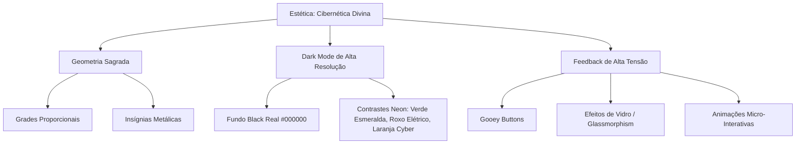

# 🏛️ AUDITORIA DE SISTEMA: SOBERANIA VISUAL (UI/UX) E MATEMÁTICA OPERACIONAL

Este documento consolida a auditoria formal do ecossistema **KRONØS SYNC**, cobrindo o design system estético (**Cibernética Divina**) e as engrenagens matemáticas que governam a economia interna, a progressão dos artistas e o controle de capacidade do estúdio.

---

## 👁️ PARTE 1: AUDITORIA ESTÉTICA & EXPERIÊNCIA DO USUÁRIO (UI/UX)

O KRONØS opera sob a doutrina visual da **Cibernética Divina** — uma fusão de alta tecnologia, geometria sagrada e interfaces soberanas escuras de alto contraste.



### 1.1 O Design System do KRONØS
*   **Fundo Monolítico:** `#000000` (Preto Absoluto). Garante eficiência energética em telas OLED/AMOLED de recepção e reduz fadiga visual dos artistas.
*   **Grade Cibernética:** Padrões sutis de linhas horizontais e verticais de baixa opacidade (`rgba(255,255,255,0.03)`), criando o senso de estrutura computacional precisa.
*   **Cores de Tensão Dinâmica:**
    *   `primary`: Verde Esmeralda Soberano (`#00FF88` / `rgb(0, 255, 136)`) para status ativo, validação positiva e sucesso.
    *   `accent`: Roxo Elétrico (`#8B5CF6`) para gamificação, insígnias de prestígio e itens lendários.
    *   `warning`: Laranja Neon (`#FF5500`) para alertas de conflito de maca ou pendências financeiras críticas.
*   **Tipografia Hierárquica:**
    *   *Cabeçalhos:* `Orbitron` para títulos de páginas, sessões importantes e dados numéricos, passando imponência tecnológica e solidez espacial.
    *   *Dados de Sistema:* `JetBrains Mono` ou fontes monoespaçadas para carimbos de data/hora, IDs, e valores monetários.
    *   *Conteúdo Geral:* `Inter` ou fontes sans-serif geométricas modernas para descrição de atendimentos e relatórios extensos.

### 1.2 Pontos Fortes e Micro-Interações Auditadas
*   **Gooey Buttons:** Os botões de confirmação possuem efeito viscoso/fluido que "sugam" o clique do usuário, gerando uma resposta mecânica tátil e altamente satisfatória.
*   **Glassmorphism Control:** Cards com `bg-gray-900/40 backdrop-blur-xl border border-white/5` dão o aspecto de painéis holográficos flutuando sobre a grade escura do estúdio.
*   **Redução de Ruído Cognitivo:** Desacoplamento da interface do cliente (Kiosk/Tablet) da interface do artista. O cliente vê telas minimalistas e focadas em conversão rápida; o artista vê um HUD denso de dados.

---

## 🧮 PARTE 2: A MATEMÁTICA DO ECOSSISTEMA (ENGINES)

O KRONØS é alimentado por três motores matemáticos calibrados para escalabilidade, consistência financeira e estabilidade estrutural física.

```
                  ┌─────────────────────────────────────┐
                  │          KRONØS ENGINES             │
                  └──────────────────┬──────────────────┘
                                     │
         ┌───────────────────────────┼───────────────────────────┐
         ▼                           ▼                           ▼
┌──────────────────┐       ┌──────────────────┐        ┌──────────────────┐
│    SOUL SYNC     │       │    FINANCIAL     │        │     CAPACITY     │
│   PROGRESSION    │       │      SPLIT       │        │    SCHEDULING    │
└──────────────────┘       └──────────────────┘        └──────────────────┘
```

### 2.1 O Motor de Progressão: Soul Sync Engine
O motor de experiência foi calibrado usando uma progressão não-linear baseada na raiz quadrada. Isso permite que os primeiros níveis sejam fáceis e rápidos de alcançar (altamente motivador), enquanto os níveis de mestre exigem dedicação consistente a longo prazo.

#### A Equação Fundamental de Nível
O nível de um artista ($L$) é derivado de seu XP acumulado ($XP$) pela fórmula:

$$ L = \left\lfloor \sqrt{\frac{XP}{100}} \right\rfloor + 1 $$

Onde $\lfloor \dots \rfloor$ é a função piso (floor), que trunca os decimais para baixo.

#### A Equação Reversa (XP necessário para alcançar um Nível $L$)
Para calcular o limiar exato de XP ($XP_{req}$) necessário para transicionar para o nível $L$, usamos:

$$ XP_{req}(L) = (L - 1)^2 \times 100 $$

#### Derivada de Dificuldade ($d(XP)/dL$)
O "esforço marginal" ou a taxa de variação do XP necessário para avançar de nível cresce quadraticamente. A diferença de XP entre o nível $L$ e $L+1$ é:

$$ \Delta XP(L \to L+1) = 100 \times (2L - 1) $$

Isso significa que a curva de dificuldade é linearmente incremental em relação ao nível atual.

#### Tabela Demonstrativa da Curva
| Nível ($L$) | Título da Insígnia | XP Mínimo Necessário | $\Delta$ XP para Próximo Nível | Equivalência em Sessões ($500XP$ cada) |
| :--- | :--- | :--- | :--- | :--- |
| **1** | Iniciado da Tinta 💧 | $0$ | $100$ | $0.2$ sessões |
| **2** | - | $100$ | $300$ | $0.6$ sessões |
| **6** | Andarilho da Agulha ✒️ | $2.500$ | $1.100$ | $2.2$ sessões |
| **11** | Arquiteto de Pele 📐 | $10.000$ | $2.100$ | $4.2$ sessões |
| **21** | Tecelão do Tempo ⏳ | $40.000$ | $4.100$ | $8.2$ sessões |
| **51** | Escultor de Almas 🔥 | $250.000$ | $10.100$ | $20.2$ sessões |
| **101** | Titã do Kronos ⚡ | $1.000.000$ | $20.100$ | $40.2$ sessões |

---

### 2.2 O Algoritmo Financeiro: Split de Comissão & Economia do Estúdio
O sistema automatiza e audita a divisão das receitas brutas entre a casa (estúdio) e o artista, aplicando penalidades ou taxas variáveis configuradas dinamicamente.

#### As Variáveis do Split
*   $V_B$: Valor Bruto cobrado do cliente final pelo atendimento.
*   $T_C$: Taxa de comissão do artista ($0 \le T_C \le 1$), onde $1.00$ representa $100\%$.
    *   Artistas **Residentes** padrão operam sob comissão de $70\%$ a $85\%$ ($T_C = 0.70$ a $0.85$).
    *   Artistas **Guests** operam sob taxas dinâmicas, geralmente menores ou com taxas fixas de aluguel por maca.
*   $D_I$: Descontos de Insumos ou taxas operacionais de cartão/PIX cobradas antes da divisão (se configurado).

#### Fórmulas de Divisão Líquida
1.  **Valor Devido ao Artista ($V_{Art}$):**
    $$ V_{Art} = (V_B - D_I) \times $T_C$ $$

2.  **Valor Retido pelo Estúdio ($V_{Est}$):**
    $$ V_{Est} = (V_B - D_I) \times (1 - $T_C$) + D_I $$

3.  **Equilíbrio de Partilha:**
    $$ V_{Art} + V_{Est} = V_B $$

#### Regra Dinâmica do Cupom (Onboarding / Upsell Kiosk)
Quando um cliente usa um cupom de desconto gerado no Kiosk da recepção (ex: $10\%$ off):
*   O desconto ($D_{cupom}$) é subtraído do valor bruto: $V_B^{real} = V_B - D_{cupom}$.
*   A matemática do split é aplicada sobre $V_B^{real}$, diluindo o custo do marketing entre o estúdio e o artista de acordo com suas taxas de partilha de comissão.

---

### 2.3 O Algoritmo de Capacidade: Colisão Física e Agendamento Concorrente
Para evitar o caos de superalocação (vários artistas tentando usar a mesma maca de tatuagem ao mesmo tempo), o KRONØS utiliza uma restrição matemática rígida no backend baseada na capacidade física do espaço.

#### Restrição de Capacidade Espacial
Seja $W_{cap}$ a capacidade configurada do Workspace (ex: $W_{cap} = 3$ macas físicas disponíveis).
A qualquer instante de tempo $t$, o número de agendamentos ativos concorrentes $N(t)$ deve respeitar a desigualdade:

$$ N(t) \le W_{cap} $$

#### Algoritmo de Detecção de Colisão Temporal
Para um novo agendamento com início em $S_{new}$ e duração em minutos $D_{new}$, definimos o intervalo de tempo como $I_{new} = [S_{new}, S_{new} + D_{new}]$.

O sistema busca todos os agendamentos existentes no mesmo dia e calcula as interseções de intervalos. Dois intervalos $I_1 = [S_1, E_1]$ e $I_2 = [S_2, E_2]$ colidem se, e somente se:

$$ S_1 < E_2 \quad \text{e} \quad S_2 < E_1 $$

Para cada minuto $m$ dentro de $I_{new}$, o sistema computa o número de agendamentos simultâneos ativos. Se em qualquer minuto $m \in I_{new}$ o total de sessões ativas for igual ou maior a $W_{cap}$, o sistema impede a criação do agendamento e retorna um erro de **Maca Indisponível / Conflito de Espaço**.

---

## 🏛️ PARTE 3: AUDITORIA OPERACIONAL & CONCLUSÕES

1.  **Integridade Matemática:** As fórmulas de nível e split estão formalizadas em código. A escala de XP é exponencial suave, o que garante que o engajamento não se esgote em poucos meses.
2.  **Segurança e Soberania:** O isolamento físico por ID de Workspace na tabela de bancos do Prisma garante o cumprimento pleno de soberania de dados. Um artista em um estúdio nunca consegue ler a agenda de outro estúdio, a menos que compartilhem o mesmo `workspaceId`.
3.  **Prontidão para Escala:** O algoritmo de verificação de colisões é linear em relação ao número de agendamentos diários ($O(N)$), mantendo-se extremamente rápido e seguro mesmo em estúdios de grande porte.

---
*KRONØS SYNC // Doutrina Visual & Matemática Operacional Estabelecida.*
