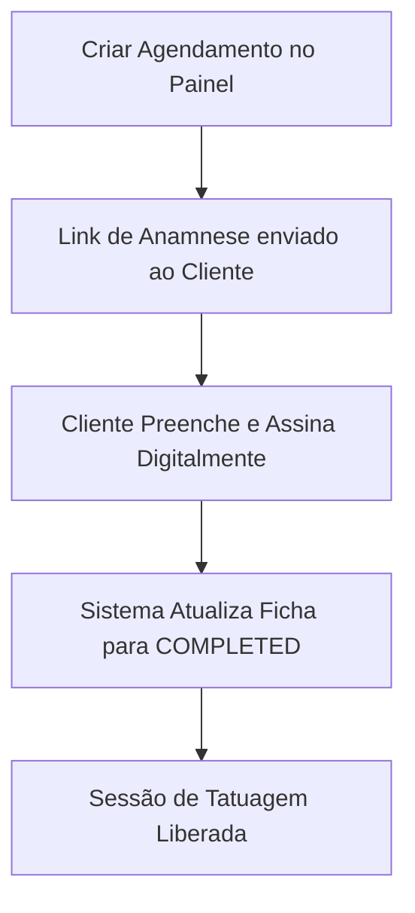

---
docsync:
  version: 2.5.0
  audience: artist
  priority: high
  intent: onboarding
---
# 🔮 Manual Operacional do Artista: KAIRØS OS

Bem-vindo ao **KAIRØS OS**, o sistema operacional de elite projetado para estúdios de tatuagem e artistas independentes de alta performance. Nossa plataforma foi desenhada para que você gaste **zero energia com burocracia** e foque 100% no que realmente importa: a sua arte.

Este manual contém todas as diretrizes, fluxos de trabalho e mecânicas da plataforma para orientar seu dia a dia.

---

## 🔑 1. Acesso e Login Soberano

O KAIRØS OS utiliza o **Clerk** para fornecer uma camada de segurança robusta e um fluxo de login simplificado e sem fricção.

*   **Seu Convite (Ink Pass):** O link único recebido associa seu e-mail ao workspace do estúdio. Não compartilhe seu link de convite.
*   **Login Sem Senha (Magic Link/OTP):** 
    1. Acesse a tela de login, insira seu e-mail.
    2. Você receberá instantaneamente um código numérico de 6 dígitos em seu e-mail.
    3. Digite o código para autenticar.
*   **Alteração de Senha Soberana:** Caso prefira login convencional, você pode configurar uma senha em **Configurações > Segurança**. O sistema utiliza hash de segurança militar para proteger seus dados.

---

## 🗓️ 2. Agenda Inteligente & Sincronização Google Calendar

O KAIRØS OS sincroniza sua agenda profissional diretamente com o seu **Google Calendar** pessoal de forma segura e privada.

*   **Privacidade de Dados:** O estúdio consegue visualizar sua grade de horários ocupados para evitar conflitos de agendamento nas macas físicas do estúdio, mas **nunca verá os detalhes dos seus compromissos pessoais** (eles aparecem apenas como "Ocupado").
*   **Como Ativar a Sincronização:**
    1. Acesse **Configurações > Integrações** no seu painel.
    2. Clique em **"Entrar com Google"** (Certifique-se de usar a conta do Google correspondente ao e-mail cadastrado).
    3. Conceda permissão de acesso ao escopo de **Google Calendar** na tela de consentimento.
    4. Uma vez conectado, qualquer agendamento criado no Kairøs será espelhado na sua agenda do Google, e seus bloqueios pessoais do Google bloquearão novos agendamentos no estúdio.

---

## 📋 3. Fluxo de Agendamento e Anamnese Digital (LGPD)

O processo de agendamento foi estruturado para garantir proteção jurídica completa para você e para o estúdio.

*   **Smart Anamnesis:** Ao cadastrar um cliente ou uma nova sessão, um link de anamnese personalizado é gerado automaticamente.
*   **Assinatura Biométrica:** O cliente pode assinar a ficha pelo celular antes de vir ao estúdio ou presencialmente no **Kiosk de Entrada**.
*   **Conformidade LGPD:** Os dados médicos dos clientes (como alergias, doenças crônicas ou uso de medicamentos) são criptografados. O cliente autoriza explicitamente quem pode visualizar essas informações de saúde para fins de segurança durante a sessão.

---

## 🎮 4. Soul Sync Engine (Gamificação de Elite)

O KAIRØS OS integra uma engine de RPG de mesa chamada **Soul Sync**, que recompensa seu desempenho e consistência profissional no estúdio.

*   **Ganhando Experiência (XP):**
    *   **Sessão Concluída:** Ganhe XP proporcional ao valor do trabalho realizado.
    *   **Novos Leads no Kiosk:** Capturar contatos qualificados e redes sociais de clientes no Kiosk de entrada gera recompensas de XP.
    *   **Acertos Financeiros Pontuais:** Realizar a liquidação da comissão do estúdio no prazo concede bônus de XP.
*   **Níveis e Conquistas (Achievements):**
    *   Suba de nível para demonstrar sua autoridade técnica e tempo de casa.
    *   Desbloqueie conquistas especiais baseadas em marcos de faturamento ou volume de agendamentos.
*   **Alquimia de Avatar (Skins):**
    *   No painel **Soul Sync**, você pode personalizar seu avatar digital com skins exclusivas divididas em 3 slots: **Base Skin**, **Máscaras** e **Artefatos**.
    *   Essas skins são desbloqueadas ao subir de nível ou cumprir desafios do estúdio.
*   **Daily Streaks:** Manter sessões ativas consecutivas ativa multiplicadores de XP para acelerar seus desbloqueios.

---

## 💰 5. Repasse Financeiro e Liquidação com IA (OCR)

Nosso modelo de faturamento opera na lógica de **Recebimento Direto**, otimizando seu fluxo de caixa.

*   **Recebimento Integral:** Você recebe o valor total da sessão diretamente do cliente (em mãos, Pix pessoal ou sua própria máquina).
*   **Cálculo de Comissão:** O sistema calcula a divisão automática (comissão padrão de 30% do estúdio / 70% do artista, podendo ser personalizada pelo administrador).
*   **Prestação de Contas (Settlement):**
    1. Vá em **Financeiro > Nova Liquidação**.
    2. Transfira a comissão devida ao estúdio via Pix (a chave Pix e o recebedor do estúdio aparecem na tela).
    3. Faça o upload do comprovante de transferência.
    4. Nossa **Inteligência Artificial (KAI)** lerá o comprovante via OCR, validará os dados e enviará para aprovação rápida do administrador.

---

## 🛍️ 6. Marketplace de Flash e Produtos

Você pode diversificar sua receita vendendo produtos ou designs diretamente pelo painel.

*   **Flashes:** Liste seus designs disponíveis para venda direta na vitrine digital do estúdio.
*   **Produtos Físicos:** Venda produtos pós-tatuagem (como pomadas hidratantes e sabonetes neutros) diretamente para seus clientes através do inventário do estúdio.
*   **Divisão Automatizada:** As vendas efetuadas no Marketplace são calculadas e adicionadas diretamente ao seu extrato de liquidação financeira.

---

## 🧠 7. KAI: Seu Assistente de Branding Pessoal

A inteligência artificial do KAIRØS, chamada **KAI**, atua como seu assistente estratégico.

*   **Análise de Portfólio:** O KAI analisa as tendências visuais do seu portfólio.
*   **Engajamento de Redes Sociais:** Integrado com seu perfil de rede social cadastrado, o assistente fornece dicas personalizadas de legendas, hashtags e melhores horários para postar seus trabalhos.
*   **Brainstorming de Criação:** Use a interface de chat com o KAI no painel para ter ideias de flashes, conceitos de projetos fechados ou textos para engajamento com clientes recorrentes.

---
*KAIRØS OS // Symbeon Labs // Protocolo de Conhecimento do Artista*
